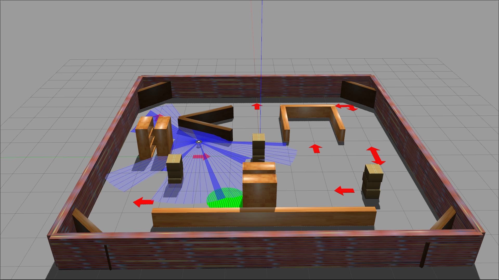
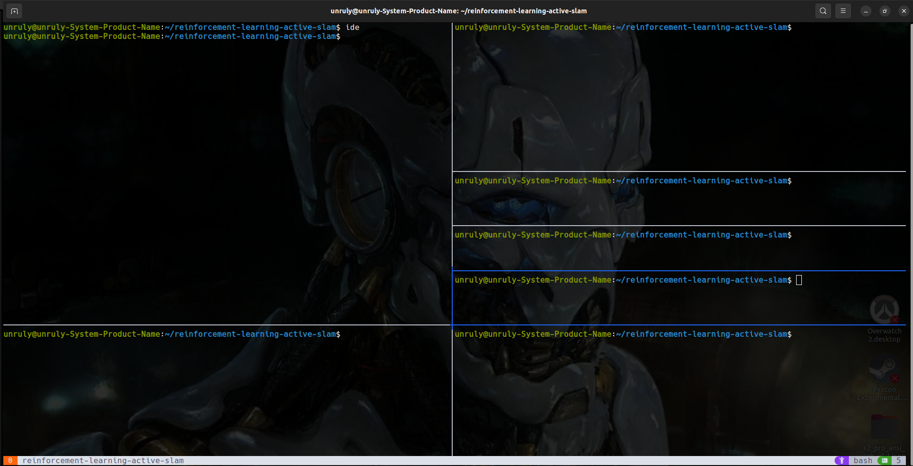

<!-- ⚠️ This README has been generated from the file(s) "blueprint.md" ⚠️--><h1 align="center">reinforcement-active-slam</h1>
<p align="center">
  
</p>


[](#table-of-contents)

## ➤ Table of Contents

* [➤ :pencil: About The Project](#-pencil-about-the-project)
* [➤ ➤ :floppy_disk: Key Project File Descriptions](#--floppy_disk-key-project-file-descriptions)
	* [`Custom Environment Files`](#custom-environment-files)
		* [active_slam_simulation package:](#active_slam_simulation-package)
		* [active_slam_learning package:](#active_slam_learning-package)
		* [active_slam_interface package:](#active_slam_interface-package)
	* [`Reinforcement Learning Files`](#reinforcement-learning-files)
		* [DDPG](#ddpg)
		* [PPO](#ppo)
		* [COMMON](#common)
	* [Robot Settings ](#robot-settings-)
	* [Environment Settings](#environment-settings)
	* [Reinforcement Learning Settings ](#reinforcement-learning-settings-)
		* [Global Settings ](#global-settings-)
		* [DDPG Settings ](#ddpg-settings-)
* [➤ :rocket: Dependencies](#-rocket-dependencies)
* [➤ :hammer: Usage](#-hammer-usage)
		* [Navigation in TMUX:](#navigation-in-tmux)
* [➤ :coffee: Buy me a coffee](#-coffee-buy-me-a-coffee)
* [➤ :scroll: Credits](#-scroll-credits)
* [➤ License](#-license)


[](#pencil-about-the-project)

## ➤ :pencil: About The Project
--------------------------

This repository explores and implements reinforcement learning strategies for active simultaneous localization and mapping (SLAM) using a single robot. The project integrates advanced machine learning algorithms, specifically Proximal Policy Optimization (PPO) and Deep Deterministic Policy Gradients (DDPG), enabling a robotic agent to autonomously explore and map unknown environments effectively.

At its core, this project seeks to bridge the gap between theoretical reinforcement learning and practical robotic applications. It focuses on creating a robust learning environment where the robot iteratively updates and adjusts its policy based on real-world dynamics. This approach applies various state-of-the-art reinforcement learning algorithms to enhance both the precision of the spatial maps generated and the efficiency of goal-based exploration in True Unknown Environments (TUE).

Designed for researchers and developers with an interest in robotics and machine learning, this project provides a deep dive into how autonomous agents can learn to adapt and navigate independently, pushing the boundaries of robotic autonomy in exploration and mapping tasks.


[](#-floppy_disk-key-project-file-descriptions)

## ➤ ➤ :floppy_disk: Key Project File Descriptions

### `Custom Environment Files`

#### active_slam_simulation package:

* [`main_world.launch.py`](src/active_slam_simulations/launch/main_world.launch.py): This file is a ROS2 launch file that currently starts up Gazebo Classic, our physics simulation engine. It also runs the robot state publisher, which handles broadcasting the robot's state and spawns the robot model in the simulation environment.

* [`slam.launch.py`](src/active_slam_simulations/launch/slam.launch.py): This file launches the **SLAM toolbox**, which we use to perform Active SLAM. This allows us to calculate map certainty and, importantly, view estimated mappings of the environment while the robot explores. The SLAM_toolbox is managed and distributed by [Steve Macenski](https://www.steve.macenski.com/) and its GitHub repository can be found [here](https://github.com/SteveMacenski/slam_toolbox).

* [`view_map.launch.py`](src/active_slam_simulations/launch/view_map.launch.py): This file launches RViz, enabling the visualisation of grid maps generated by the SLAM algorithm.

* [`models folder`](src/active_slam_simulations/models): This folder contains the model files for our simulation, including the [Turtlebot3_burger](https://www.turtlebot.com/turtlebot3/) robot and the goal pad.

* [`worlds folder`](src/active_slam_simulations/worlds): This folder contains the different custom SDF world files which took a very very very long time to create :thumbsup:

#### active_slam_learning package:

* [`learning_environment.py`](src/active_slam_learning/active_slam_learning/learning_environment/learning_environment.py): This file defines a Learning Environment node for simulating a single-robot system that learns to autonomously explore True Unknown Environments using reinforcement learning through ROS2. It manages state updates, action processing, and reward calculations necessary for RL experiments. Key components include handling robot velocities, calculating map uncertainty using D-Optimality and computing rewards. The environment interacts with the robot and simulated Gazebo environment to facilitate the training and evaluation of learning agents primarily through the custom Gazebo Bridge.

* [`gazebo_bridge.py`](src/active_slam_learning/active_slam_learning/gazebo_bridge/gazebo_bridge.py): This file implements a custom Gazebo Bridge node, which handles direct communication with Gazebo services and the training environment. It manages the spawning and movement of goal and robot models, resets the SLAM algorithm provided by the [**SLAM toolbox**](https://github.com/SteveMacenski/slam_toolbox) and provides services for managing simulation states such as pausing and unpausing the physics engine.

* [`reward_function.py`](src/active_slam_learning/active_slam_learning/learning_environment/reward_function.py): This file implements the reward function for the reinforcement learning (RL) agent:

     
    * **Initial Reward**: The reward calculation's starting point is -0.2. 
    * **Linear Velocity Penalty**: Encourages the robot to maintain a higher linear velocity, calculated as -0.1 times the difference between the maximum speed and the current linear velocity. 
        
        ~ This ranges from -0.04 to 0 for linear velocities between -0.2 and 0.2. 
        
    * **Angular Velocity Penalty**: Penalises higher angular velocities, calculated as -0.01 times the square of the angular velocity. 
    
        ~ This ranges from -0.0484 to 0 for angular velocities between -2.2 and 2.2. 
    
    * **Collision Penalty**: Imposes a penalty of -1 if the robot collides with an obstacle. 
    
    * **Goal Reward**: Rewards the robot with 1 if it successfully finds the goal.  
    * **Map Uncertainty Reward**: Provides a positive intrinsic reward based on the map uncertainty (D-Optimality). If D-Optimality is not provided, the reward is 0. Otherwise, it is calculated as the hyperbolic tangent of 0.01 divided by the D-Optimality value. 

      ~ This ranges from 0 to 1. 

#### active_slam_interface package:

* [`srv`](src/active_slam_interfaces/srv): This folder contains service types used by individual Nodes to communicate with each other, an essential foundation of the ROS framework.

* [`msg`](src/active_slam_interfaces/msg): This folder contains msg types used by individual Nodes to communicate with each other, an essential foundation of the ROS framework.


### `Reinforcement Learning Files`

#### DDPG

* [`learning_ddpg.py`](src/active_slam_learning/active_slam_learning/learning/learning_ddpg.py): Facilitates the main training loop of the Deep Deterministic Policy Gradient algorithm, including Frame stacking, frame skipping, reward normalisation, initialising the model and the memory buffer, handling the scoring metrics per episode and lastly saving the training data for evaluation later.

* [`agent.py`](src/active_slam_learning/active_slam_learning/learning/ddpg/agent.py): Defines the main agent interacting with the environment. It encapsulates the logic for selecting actions, applying noise, learning and updating the policy.

* [`replay_memory.py`](src/active_slam_learning/active_slam_learning/learning/ddpg/replay_memory.py): This file implements the replay memory buffer, storing the agent's experiences during training. It allows for random sampling of experiences to stabilise training by breaking the correlation between consecutive experiences.

* [`networks.py`](src/active_slam_learning/active_slam_learning/learning/ddpg/networks.py): This file defines the neural network architectures used for the actor and critic models in the DDPG algorithm. These networks are responsible for approximating the policy and value functions.


#### PPO

Wait wait wait wait coming soon this that and the third


#### COMMON

* [`utilities.py`](src/active_slam_learning/active_slam_learning/common/utilities.py): Includes helper functions for communicating with the [learning environment node](src/active_slam_learning/active_slam_learning/learning_environment/learning_environment.py).

* [`settings.py`](src/active_slam_learning/active_slam_learning/common/settings.py): Contains all the configuration settings for the training process. Users can very much use this project by only ever changing this file

The following settings and options are exposed to you:

### Robot Settings 
* `MAX_LINEAR_SPEED`: Maximum linear speed (0.22) 
* `MAX_ANGULAR_SPEED`: Maximum angular speed (2.0) 
* `MAX_SCAN_DISTANCE`: Maximum scan distance (3.5) 
* `NUMBER_OF_SCANS`: Number of scans (90) 
* `COLLISION_DISTANCE`: Collision distance (0.18) 
### Environment Settings
* `ENVIRONMENT_OBSERVATION_SPACE`: Observation space for the environment (NUMBER\_OF\_SCANS + 2) 
* `ENVIRONMENT_ACTION_SPACE`: Action space for the environment (2) 

* `EPISODE_LENGTH_SEC`: Episode length in seconds (60) 
* `EPISODE_STEPS`: Number of steps in an episode (1000) 
* `GOAL_PAD_RADIUS`: Radius of the goal pad (0.7) 
* `REWARD_DEBUG`: Debug mode for rewards (True) 

### Reinforcement Learning Settings 

#### Global Settings 
* `LOAD_MODEL`: Whether to load a pre-trained model (False) 
* `MODEL_PATH`: Path to the model ("training\_data/models/single\_robot\_exploration") 
* `TRAINING_STEPS`: Number of training steps (1\_000\_000) 
* `RANDOM_STEPS`: Number of random steps (25000) 
* `MAX_MEMORY_SIZE`: Maximum memory size (1\_000\_000) 
* `FRAME_BUFFER_DEPTH`: Frame buffer depth (3) 
* `FRAME_BUFFER_SKIP`: Frame buffer skip (10) 

* `TRAINING_EPISODES`: Number of training episodes (2000) 

#### DDPG Settings 
* `ALPHA_DDPG`: Learning rate for the actor (0.0001) 
* `BETA_DDPG`: Learning rate for the critic (0.0003) 
* `TAU`: Soft update parameter (0.005) 
* `GAMMA_DDPG`: Discount factor (0.99) 
* `BATCH_SIZE_DDPG`: Batch size (100) 
* `ACTOR_DDPG_FC1`: Number of units in the first fully connected layer of the actor (400) 
* `ACTOR_DDPG_FC2`: Number of units in the second fully connected layer of the actor (512) 
* `CRITIC_DDPG_FC1`: Number of units in the first fully connected layer of the critic (512) 
* `CRITIC_DDPG_FC2`: Number of units in the second fully connected layer of the critic (512) 


[](#rocket-dependencies)

## ➤ :rocket: Dependencies

**This project is developed using; ROS2 and Gazebo for simulation and coordination of multiple robotic agents and Pytorch for Reinforcement Learning**


[](https://docs.ros.org/en/humble/index.html)[](https://www.python.org/) [](https://pytorch.org/) [](https://numpy.org/)[](https://gazebosim.org/home)


[](#hammer-usage)

## ➤ :hammer: Usage

I highly recommend running this with [TMUX](https://github.com/tmux/tmux/wiki). Tmux allows us to split the terminal into panes to view all the essential ROS2 processes simultaneously.

<p align="center">
  
</p>

Start tmux with:

```
tmux
```

First source ROS2 Humble with the command:

```
source /opt/ros/humble/setup.bash

```

Change into the workspace directory:

```
cd reinforcement-learning-active-slam
```

and run the following lines to split the panes:

```
tmux split-window -v -p 30
tmux split-window -h -p 50
tmux split-window -h -p 50 -t 0
tmux split-window -v -p 50 -t 1
tmux split-window -v -p 66
tmux split-window -v -p 50
tmux select-pane -t 6
```

***If you dont have tmux, you may create 5 seperate terminal windows instead***


Launch the gazebo simulation physics engine with our robot model:

```
source install/setup.bash
ros2 launch active_slam_simulations main_world.launch.py
tmux select-pane -t 4
```

Next launch the SLAM algorithm from the slam toolbox:

```
source install/setup.bash
ros2 launch active_slam_simulations slam.launch.py
tmux select-pane -t 5
```

Next run the Gazebo Bridge node:

```
source install/setup.bash
ros2 run active_slam_learning gazebo_bridge
tmux select-pane -t 1
```
Next run the Learning Environment node:
```
source install/setup.bash
ros2 run active_slam_learning learning_environment
tmux select-pane -t 3
```

Startup RViz to see the map the robot generates per episode:
```
source install/setup.bash
ros2 launch active_slam_simulations view_map.launch.py
tmux select-pane -t 0
```


Lastly start the Learning node (**DDPG or PPO**):
```
source install/setup.bash
ros2 run active_slam_learning learning_ddpg
```

#### Navigation in TMUX:

Please refer to this [cheatsheet](https://tmuxcheatsheet.com/) for more information but two heplful commands are:

`ctrl+b o` ~ To switch to the next pane

and 

`ctrl+b z` ~ To zoom in and out of a pane


 


[](#coffee-buy-me-a-coffee)

## ➤ :coffee: Buy me a coffee
Whether you use this project, have learned something from it, or just like it, please consider supporting it by buying me a coffee, so I can dedicate more time on open-source projects like this (҂⌣̀_⌣́)

<a href="https://www.buymeacoffee.com/i1Cps" target="_blank"></a>


[](#scroll-credits)

## ➤ :scroll: Credits

Theo Moore-Calters 


[](https://github.com/i1Cps) [](https://linkedin.com/in/theo-moore-calters)


[](#license)

## ➤ License
	
Licensed under [MIT](https://opensource.org/licenses/MIT).


